# Processamento Digital de Imagens - DCA0445

## Tarefas referentes à primeira unidade da discplina DCA0445

### Aluno: Jefferson Estevo Feitosa
-------------------------------------------------------------------
# Exercícios

**1. Utilizando o programa exemplos/pixels.cpp como referência, implemente um programa regions.cpp. Esse programa deverá solicitar ao usuário as coordenadas de dois pontos P1 e P2 localizados dentro dos limites do tamanho da imagem e exibir que lhe for fornecida. Entretanto, a região definida pelo retângulo de vértices opostos definidos pelos pontos P1 e P2 será exibida com o negativo da imagem na região correspondente.**

Para fazer a implementação irei utilizar a imagem _"biel.png"_: 

Resultado da saída do programa: 
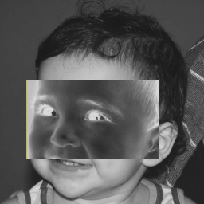

Abaixo temos o código que faz a conversão da região passada, em negativo.
```c++
#include <iostream>
#include <opencv2/opencv.hpp>

using namespace cv;
using namespace std;

int main(int, char**){
  Mat image;
  Vec3b val;

  image= imread("imagens/biel.png", IMREAD_COLOR); //IMREAD_GRAYSCALE
  
  if(!image.data)
    cout << "nao abriu biel.png" << endl;	
	
   int x1=1,y1=1, x2=1, y2=1;

   cout << "linhas: " << image.rows << endl;
   cout << "colunas: " << image.cols << endl;
   
   cout << "Digite a coordenada x do primeiro ponto:" << endl;
   cin >> x1;		
   while(x1 > image.rows || x1 < 1){
   	cout << "digite um valor de linha menor: " << endl;	
   	cin >> x1;
   }
   
   cout << "Digite a coordenada y do primeiro ponto:" << endl;
   cin >> y1;   
   while(y1 > image.cols || y1 < 1){
   	cout << "digite um valor de coluna menor: " << endl;	
   	cin >> y1;
   }
   
   cout << "Digite a coordenada x do segundo ponto:" << endl;
   cin >> x2;		
   while(x2 > image.rows || x2 < 1){
   	cout << "digite um valor de linha menor:" << endl;	
   	cin >> x2;
   }
   
   cout << "Digite a coordenada y do segundo ponto:" << endl;
   cin >> y2;
   while(y2 > image.cols || y2 < 1){
   	cout << "digite um valor de coluna menor: " << endl;	
   	cin >> y2;
   }
   
   //para ajustar ao tamanho da janela a imagem passada                      
   namedWindow("janela", WINDOW_AUTOSIZE);


   //algoritmo negativo	  
   for(int i=x1; i< x2; i++){
    for(int j=y1; j< y2*3; j++){
      image.at<uchar>(i,j)=255-image.at<uchar>(i,j);
    }
  }

  imwrite("/imagensnegativo.png", image);
  imshow("janela", image);
  waitKey();
  return 0;

}
```
**2. Utilizando o programa exemplos/pixels.cpp como referência, implemente um programa trocaregioes.cpp. Seu programa deverá trocar os quadrantes em diagonal na imagem. Explore o uso da classe Mat e seus construtores para criar as regiões que serão trocadas.**

O progrma também foi implementado utilizando a imagem _"biel.png"_ como referência.

Resultado da saída do programa: 


Abaixo temos o código que faz a troca das regiões dos 4 quadrantes.
```c++
#include <iostream>
#include <opencv2/opencv.hpp>

using namespace cv;
using namespace std;

int main(int, char **){
    Vec3b val; //nao foi utilizada nesse codigo

    Mat image;
    image = imread("imagens/biel.jpg", IMREAD_COLOR);
    if (!image.data){
        cout << "nao foi possivel abrir a imagem." << endl;
    }
    namedWindow("janela", WINDOW_AUTOSIZE);

    cout << "A imagem tem(altura, largura):" << endl;
    cout <<image.size().height << " " << image.size().width;

    //salvando o 1º quadrante em uma estrutura rect do tipo Rect
    //A ordem é: colunas, linhas
    Rect rect = Rect(0,0, image.cols/2, image.rows/2);
    //ou Rect rect(0,0, image.rows/2, image.cols/2);
   
    //fazendo cópia do 1º quadrante
    Mat temp_img = image(rect).clone();

    //fazendo cópia do 4º quadrante para o 1º
    image(Rect(image.cols/2,image.rows/2,image.cols/2,image.rows/2)).copyTo(image(rect));

    //fazendo cópia do 1º para o 4º
    temp_img.copyTo(image(Rect(image.cols/2,image.rows/2,image.cols/2,image.rows/2)));

    //salvando o 2º quadrante
    rect = Rect(image.cols/2,0, image.rows/2, image.cols/2);
    
    //fazendo cópia do 2º quadrante
    temp_img = image(rect).clone();
    
    //fazendo cópia do 3º quadrante para o 1º
    image(Rect(0,image.rows/2,image.cols/2,image.rows/2)).copyTo(image(rect));
    
    //fazendo cópia do 1º quadrnate para o 3º
    temp_img.copyTo(image(Rect(0,image.rows/2,image.cols/2,image.rows/2)));

    imshow("janela", image);
    waitKey();
    imwrite("imagens/trocaregioesOUT.png", image);

    return 0;
}
```
**3. Observando-se o programa labeling.cpp como exemplo, é possível verificar que caso existam mais de 255 objetos na cena, o processo de rotulação poderá ficar comprometido. Identifique a situação em que isso ocorre e proponha uma solução para este problema.**

**Aprimore o algoritmo de contagem apresentado para identificar regiões com ou sem buracos internos que existam na cena. Assuma que objetos com mais de um buraco podem existir. Inclua suporte no seu algoritmo para não contar bolhas que tocam as bordas da imagem. Não se pode presumir, a priori, que elas tenham buracos ou não.**

Para fazer a implementação irei utilizar a imagem _"bolhas.png"_: 


Imagem com bordas removidas: 


Imagem da contagem das bolhas feitas, alterando o tom de cinza para visualização: 
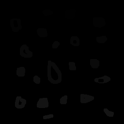

Imagem das bolhas que não possuem bohas internas: 
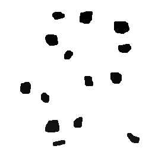

Resultado da saída do programa: 
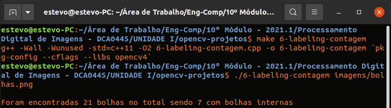

Abaixo temos o código que faz a contagem de bolhas.
```c++
#include <iostream>
#include <opencv2/opencv.hpp>

using namespace cv;
using namespace std;

int main(int argc, char ** argv) {
    Mat image;
    int width, height, nobjects, bolhasinternas;

    Point p;
    image = imread(argv[1], IMREAD_GRAYSCALE);

    if ( ! image.data) {
        cout << "imagem nao carregou corretamente\n";
        return (-1);
    }
    width = image.size().width;
    height = image.size().height;

    p.x = 0;
    p.y = 0;

    //Varredura nas Bordas
    //Horizontal
    for (int i = 0; i < height; i = i + height - 1) {
        for (int j = 0; j < width; j++) {
            if (image.at<uchar>(i,j) == 255) {
                // achou um objeto
                p.x = j;
                p.y = i;
                floodFill(image, p, 0);
            }
        }
    }
    //Vertical
    for (int i = 0; i < height; i++) {
        for (int j = 0; j < width; j = j + width - 1) {
            if (image.at<uchar>(i,j) == 255) {
                // achou um objeto
                p.x = j;
                p.y = i;
                floodFill(image, p, 0);
            }
        }
    }

    imwrite("imagens/labeling-bordas.png", image);
    p.x=0;
    p.y=0;
    nobjects=0;
    for(int i=0; i<height; i++){
        for(int j=0; j<width; j++){
            if(image.at<uchar>(i,j) == 255){
                // achou um objeto
                nobjects++;
                p.x=j;
                p.y=i;
                floodFill(image,p,nobjects);
            }
        }
    }

    imwrite("imagens/labeling-final.png", image);
    bolhasinternas = 0;
    // busca objetos com buracos presentes
    p.x = 0;
    p.y = 0;
    floodFill(image, p, 255);

    for (int i = 1; i < height-1; i++) {
        for (int j = 1; j < width-1; j++) {
            if (image.at<uchar>(i-1, j) > 0 
                && image.at<uchar>(i-1,j) < 255 
                && image.at<uchar>(i,j) == 0)
            {
                // achou um objeto
                bolhasinternas++;
                p.x = j;
                p.y = i-1;
                floodFill(image, p, 255);
                p.x = j;
                p.y = i;
                floodFill(image, p, 255);
            }
        }
    }

    imshow("image", image);
    imwrite("imagens/labeling-com-bolhas.png", image);
    waitKey();
    cout << "\nForam encontradas " << nobjects << " bolhas no total sendo " << bolhasinternas << " com bolhas internas \n";
    return 0;
}
```
**4. Utilizando o programa exemplos/histogram.cpp como referência, implemente um programa equalize.cpp. Este deverá, para cada imagem capturada, realizar a equalização do histogram antes de exibir a imagem. Teste sua implementação apontando a câmera para ambientes com iluminações variadas e observando o efeito gerado. Assuma que as imagens processadas serão em tons de cinza.**

**Utilizando o programa exemplos/histogram.cpp como referência, implemente um programa motiondetector.cpp. Este deverá continuamente calcular o histograma da imagem (apenas uma componente de cor é suficiente) e compará-lo com o último histograma calculado. Quando a diferença entre estes ultrapassar um limiar pré-estabelecido, ative um alarme. Utilize uma função de comparação que julgar conveniente.**

Imagem normal, gerada apenas mostrando seu histograma 
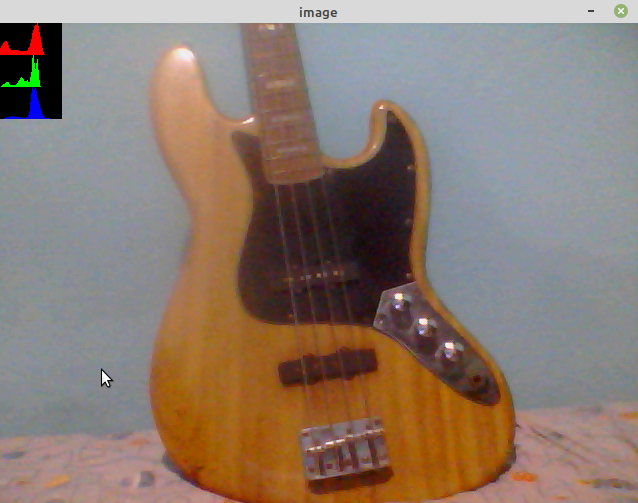

Imagem equalizada gerada com o algoritmo _equalize.cpp_: 
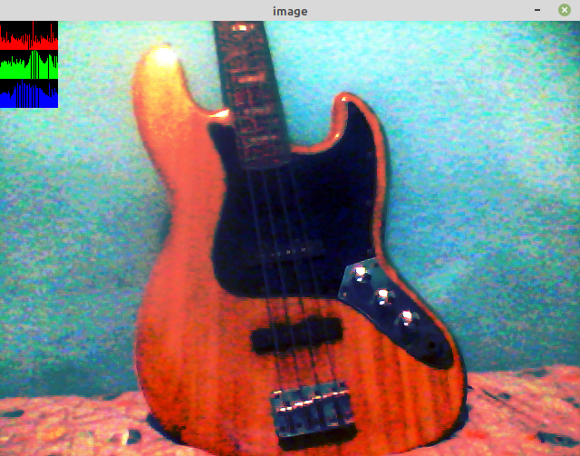

Abaixo temos o código do algoritmo _equalize.cpp_.
```c++
#include <iostream>
#include <opencv2/opencv.hpp>

using namespace cv;
using namespace std;

int main(int argc, char** argv){
  Mat image;
  int width, height;
  VideoCapture cap;
  vector<Mat> planes;
  Mat histR, histG, histB;
  int nbins = 64;
  float range[] = {0, 256};
  const float *histrange = { range };
  bool uniform = true;
  bool acummulate = false;

  cap.open(0);

  if(!cap.isOpened()){
    cout << "cameras indisponiveis";
    return -1;
  }

  width  = cap.get(CAP_PROP_FRAME_WIDTH);
  height = cap.get(CAP_PROP_FRAME_HEIGHT);

  cout << "largura = " << width << endl;
  cout << "altura  = " << height << endl;

  int histw = nbins, histh = nbins/2;
  Mat histImgR(histh, histw, CV_8UC3, Scalar(0,0,0));
  Mat histImgG(histh, histw, CV_8UC3, Scalar(0,0,0));
  Mat histImgB(histh, histw, CV_8UC3, Scalar(0,0,0));

  while(1){
    cap >> image;
    split (image, planes);

    equalizeHist(planes[0], planes[0]);
    equalizeHist(planes[1], planes[1]);
    equalizeHist(planes[2], planes[2]);    
     
    merge(planes, image); 

    calcHist(&planes[0], 1, 0, Mat(), histR, 1,
             &nbins, &histrange,
             uniform, acummulate);
    calcHist(&planes[1], 1, 0, Mat(), histG, 1,
             &nbins, &histrange,
             uniform, acummulate);
    calcHist(&planes[2], 1, 0, Mat(), histB, 1,
             &nbins, &histrange,
             uniform, acummulate);

    

    normalize(histR, histR, 0, histImgR.rows, NORM_MINMAX, -1, Mat());
    normalize(histG, histG, 0, histImgG.rows, NORM_MINMAX, -1, Mat());
    normalize(histB, histB, 0, histImgB.rows, NORM_MINMAX, -1, Mat());
    
    histImgR.setTo(Scalar(0));
    histImgG.setTo(Scalar(0));
    histImgB.setTo(Scalar(0));

    for(int i=0; i<nbins; i++){
      line(histImgR,
           Point(i, histh),
           Point(i, histh-cvRound(histR.at<float>(i))),
           Scalar(0, 0, 255), 1, 8, 0);
      line(histImgG,
           Point(i, histh),
           Point(i, histh-cvRound(histG.at<float>(i))),
           Scalar(0, 255, 0), 1, 8, 0);
      line(histImgB,
           Point(i, histh),
           Point(i, histh-cvRound(histB.at<float>(i))),
           Scalar(255, 0, 0), 1, 8, 0);
    }

    histImgR.copyTo(image(Rect(0, 0       ,nbins, histh)));
    histImgG.copyTo(image(Rect(0, histh   ,nbins, histh)));
    histImgB.copyTo(image(Rect(0, 2*histh ,nbins, histh)));
    imshow("image", image);
    if(waitKey(30) >= 0) break;
  }
  return 0;
}
```

Imagem gerada pelo programa _motiondetector.cpp_: 
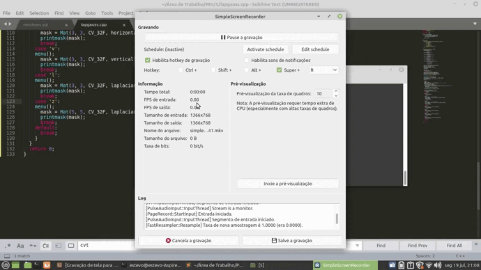

Abaixo temos o código do algoritmo _motiondetector.cpp_.
```c++
#include <iostream>
#include <opencv2/opencv.hpp>
#include <opencv2/imgproc/types_c.h> // Para corrigir - -  error: ‘CV_COMP_CORREL’ was not declared in this scope

using namespace cv;
using namespace std;

int main(int argc, char** argv){
  Mat image;
  int width, height;
  VideoCapture cap;
  vector<Mat> planes;
  Mat histR, histG, histB, histS, histS1;
  int nbins = 64, count_frames = 99999999;
  float range[] = {0, 256};
  double flag;
  const float *histrange = { range };
  bool uniform = true;
  bool acummulate = false;

  cap.open(0);
  
  if(!cap.isOpened()){
    cout << "cameras indisponiveis";
    return -1;
  }
  
  width  = cap.get(CAP_PROP_FRAME_WIDTH);
  height = cap.get(CAP_PROP_FRAME_HEIGHT);

  cout << "largura = " << width << endl;
  cout << "altura  = " << height << endl;

  int histw = nbins, histh = nbins/2;
  Mat histImgR(histh, histw, CV_8UC3, Scalar(0,0,0));
  Mat histImgG(histh, histw, CV_8UC3, Scalar(0,0,0));
  Mat histImgB(histh, histw, CV_8UC3, Scalar(0,0,0));
  Mat histImgS(histh, histw, CV_8UC3, Scalar(0,0,0));

  while(1){
    cap >> image;
    split (image, planes);
    if(count_frames > 30){
        count_frames = 0;
        calcHist(&planes[0], 1, 0, Mat(), histS, 1, &nbins, &histrange, uniform, acummulate);
    }

    calcHist(&planes[0], 1, 0, Mat(), histR, 1,
             &nbins, &histrange,
             uniform, acummulate);
    calcHist(&planes[1], 1, 0, Mat(), histG, 1,
             &nbins, &histrange,
             uniform, acummulate);
    calcHist(&planes[2], 1, 0, Mat(), histB, 1,
             &nbins, &histrange,
             uniform, acummulate);

    normalize(histR, histR, 0, histImgR.rows, NORM_MINMAX, -1, Mat());
    normalize(histG, histG, 0, histImgG.rows, NORM_MINMAX, -1, Mat());
    normalize(histB, histB, 0, histImgB.rows, NORM_MINMAX, -1, Mat());
     
    calcHist(&planes[0], 1, 0, Mat(), histS1, 1, &nbins, &histrange, uniform, acummulate);
    flag = compareHist(histS1, histS, CV_COMP_CORREL); //comparação que detecta a variação de movimentos

    
    if( flag < 0.80 ){
    cout << "Alarme com flag > "<< flag << endl;
    }

    histImgR.setTo(Scalar(0));
    histImgG.setTo(Scalar(0));
    histImgB.setTo(Scalar(0));
    
    for(int i=0; i<nbins; i++){
      line(histImgR,
           Point(i, histh),
           Point(i, histh-cvRound(histR.at<float>(i))),
           Scalar(0, 0, 255), 1, 8, 0);
      line(histImgG,
           Point(i, histh),
           Point(i, histh-cvRound(histG.at<float>(i))),
           Scalar(0, 255, 0), 1, 8, 0);
      line(histImgB,
           Point(i, histh),
           Point(i, histh-cvRound(histB.at<float>(i))),
           Scalar(255, 0, 0), 1, 8, 0);
    }
    
    histImgR.copyTo(image(Rect(0, 0       ,nbins, histh)));
    histImgG.copyTo(image(Rect(0, histh   ,nbins, histh)));
    histImgB.copyTo(image(Rect(0, 2*histh ,nbins, histh)));
    count_frames++;
    imshow("image", image);
    if(waitKey(30) >= 0) break;
  }
  return 0;
}
```
**5. Utilizando o programa exemplos/filtroespacial.cpp como referência, implemente um programa laplgauss.cpp. O programa deverá acrescentar mais uma funcionalidade ao exemplo fornecido, permitindo que seja calculado o laplaciano do gaussiano das imagens capturadas. Compare o resultado desse filtro com a simples aplicação do filtro laplaciano.**

Imagem normal, que será utilizada para fazer as comparações 


Imagem gerada a partir do algoritmo _filtroespacial.cpp_, utilizando o filtro laplaciano: 
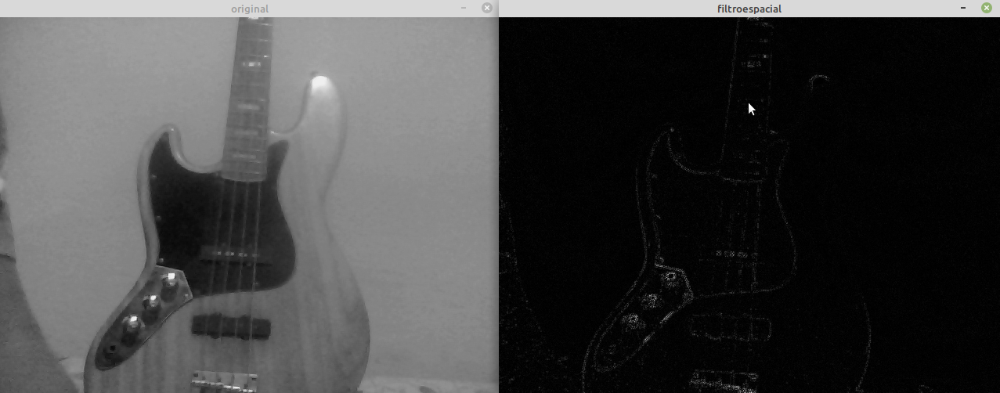

Imagem gerada a partir do algoritmo _laplgauss.cpp_, juntando os filtros laplaciano e gaussiano: 
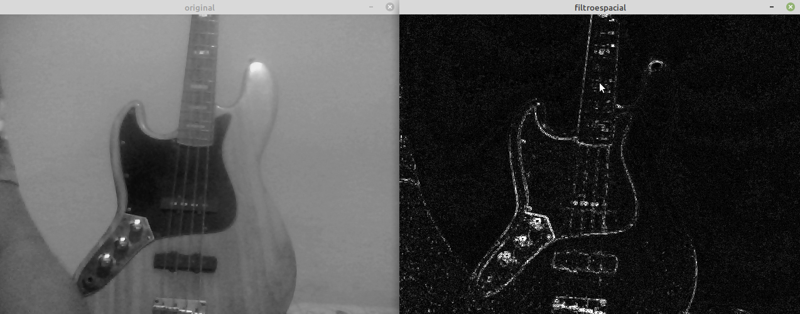

Abaixo temos o código do algoritmo _laplgauss.cpp_.
```c++
#include <iostream>
#include <opencv2/opencv.hpp>

using namespace cv;
using namespace std;

void printmask(Mat &m){
  for(int i=0; i<m.size().height; i++){
    for(int j=0; j<m.size().width; j++){
      cout << m.at<float>(i,j) << ",";
    }
    cout << endl;
  }
}

void menu(){
  cout << "\npressione a tecla para ativar o filtro: \n"
  "a - calcular modulo\n"
  "m - media\n"
  "g - gauss\n"
  "v - vertical\n"
  "h - horizontal\n"
  "l - laplaciano\n"
  "n - laplaciano do gaussiano\n" 
  "esc - sair\n";
}

int main(int argvc, char** argv){
  VideoCapture video;
  float media[] = {1,1,1,
           1,1,1,
           1,1,1};
  float gauss[] = {1,2,1,
           2,4,2,
           1,2,1};
  float horizontal[]={-1,0,1,
            -2,0,2,
            -1,0,1};
  float vertical[]={-1,-2,-1,
          0,0,0,
          1,2,1};
  float laplacian[]={0,-1,0,
           -1,4,-1,
           0,-1,0};
  float laplacian_gauss[]={0,0,-1,0,0,
           0,-1,-2,-1,0,
           -1,-2,16,-2,-1,
           0,-1,-2,-1,0,
           0,0,-1,0,0};

  Mat cap, frame, frame32f, frameFiltered;
  Mat mask(3,3,CV_32F), mask1;
  Mat result, result1;
  double width, height, min, max;
  int absolut;
  char key;
  
  video.open(0); 
  if(!video.isOpened()) 
    return -1;
  width=video.get(CAP_PROP_FRAME_WIDTH);
  height=video.get(CAP_PROP_FRAME_HEIGHT);
  std::cout << "largura=" << width << "\n";;
  std::cout << "altura =" << height<< "\n";;

  namedWindow("filtroespacial",1);

  mask = Mat(3, 3, CV_32F, media); 
  scaleAdd(mask, 1/9.0, Mat::zeros(3,3,CV_32F), mask1);
  swap(mask, mask1);
  absolut=1; // calcula o valor absoluto da imagem

  menu();
  for(;;){
    video >> cap; 
    cvtColor(cap, frame, COLOR_BGR2GRAY);// antigo CV_BGR2GRAY
    flip(frame, frame, 1);
    imshow("original", frame);
    frame.convertTo(frame32f, CV_32F);
    filter2D(frame32f, frameFiltered, frame32f.depth(), mask, Point(1,1), 0);
    if(absolut){
      frameFiltered=abs(frameFiltered);
    }
    frameFiltered.convertTo(result, CV_8U); 
    
    imshow("filtroespacial", result);
    key = (char) waitKey(10);
    if( key == 27 ) break; // tecla esc pressionada
    switch(key){
    case 'a':
    menu();
      absolut=!absolut;
      break;
    case 'm':
    menu();
      mask = Mat(3, 3, CV_32F, media);
      scaleAdd(mask, 1/9.0, Mat::zeros(3,3,CV_32F), mask1);
      mask = mask1;
      printmask(mask);
      break;
    case 'g':
    menu();
      mask = Mat(3, 3, CV_32F, gauss);
      scaleAdd(mask, 1/16.0, Mat::zeros(3,3,CV_32F), mask1);
      mask = mask1;
      printmask(mask);
      break;
    case 'h':
    menu();
      mask = Mat(3, 3, CV_32F, horizontal);
      printmask(mask);
      break;
    case 'v':
    menu();
      mask = Mat(3, 3, CV_32F, vertical);
      printmask(mask);
      break;
    case 'l':
    menu();
      mask = Mat(3, 3, CV_32F, laplacian);
      printmask(mask);
      break;
    case 'z':
    menu();
      mask = Mat(5, 5, CV_32F, laplacian_gauss);
      printmask(mask);
      break;
    default:
      break;
    }
  }
  return 0;
}
```
É possível perceber, que o filto _laplgauss_ reconhece bordas na vertical e na horizontal e também gera um pouco de ruídos na imagem.

**6. Utilizando o programa exemplos/addweighted.cpp como referência, implemente um programa tiltshift.cpp. Três ajustes deverão ser providos na tela da interface:
    um ajuste para regular a altura da região central que entrará em foco;
    um ajuste para regular a força de decaimento da região borrada; 
    um ajuste para regular a posição vertical do centro da região que entrará em foco. Finalizado o programa, a imagem produzida deverá ser salva em arquivo.**
    
**Utilizando o programa exemplos/addweighted.cpp como referência, implemente um programa tiltshiftvideo.cpp. Tal programa deverá ser capaz de processar um arquivo de vídeo, produzir o efeito de tilt-shift nos quadros presentes e escrever o resultado em outro arquivo de vídeo. A ideia é criar um efeito de miniaturização de cenas. Descarte quadros em uma taxa que julgar conveniente para evidenciar o efeito de stop motion, comum em vídeos desse tipo.**

Imagem normal, que será utilizada para fazer as comparações 
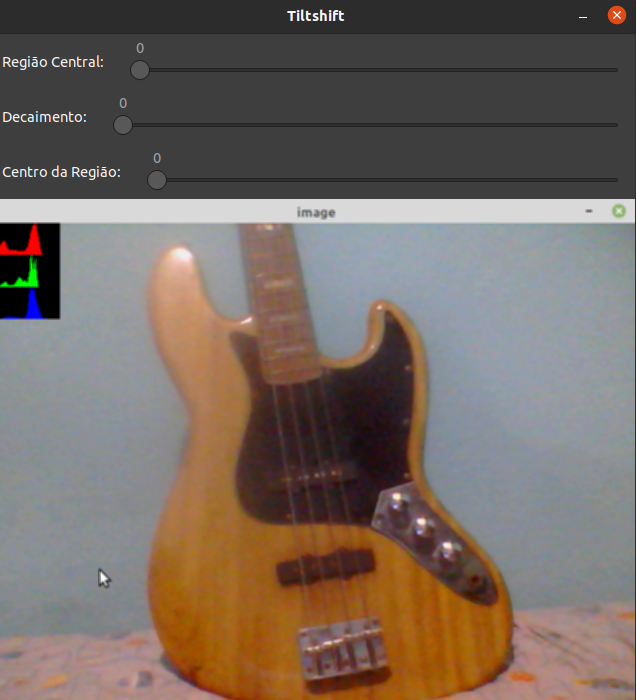

Imagem gerada a partir do algoritmo _tiltshift.cpp_ com  a regulagem para melhorar a nitidez na parte dos botões do contra-baixo:
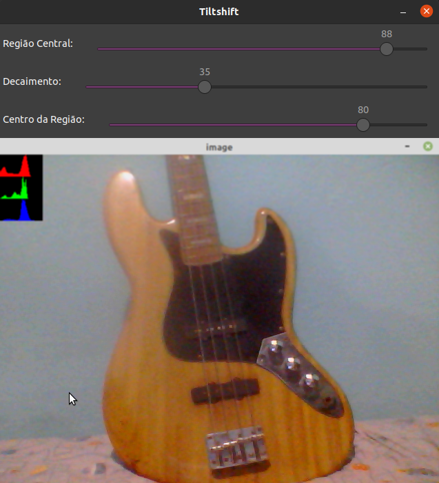

Abaixo temos o código do algoritmo _tiltshift.cpp_.
```c++
#include <iostream>
#include <opencv2/opencv.hpp>

using namespace cv;
using namespace std;

Mat mask(3,3,CV_32F), mask1;
Mat image32f, imageFiltered, result;
Mat image1, image2;

double alfa;
double l1, l2;

int y_max;
int altura = 0, centro = 0, decaimento = 1;
int regiao_slider = 0, decaimento_slider = 0, centro_slider = 0;
int maximo = 100;

char TrackbarName[50];

// Ajuste para regular a altura da região central que entrará em foco
void on_trackbar_regiao(int, void*){
	// Calculo do centro da imagem desejado
	altura = (double) (regiao_slider * y_max) / maximo;
	
	// Calculo de l1 e l2 (linhas cujo valor de αlfa assume valor em torno de 0.5)
	l1 = centro - altura/2; 
	l2 = centro + altura/2;
       
	for(int i = 0; i < result.size().height; i++)
	{
        	alfa = 0.5 * (tanh((i - l1) / decaimento) - tanh((i - l2) / decaimento));
        	addWeighted(image1.row(i), alfa, result.row(i), 1.0 - alfa, 0.0, image2.row(i));
        }
 
	imshow("Tiltshift",image2);
        imwrite("Tiltshift.png",image2); 
}

// Ajuste para regular a força de decaimento da região borrada
void on_trackbar_decaimento(int, void*){
	// O decaimento mínimo será 1 devido o cálculo do alfa
	decaimento = (double) decaimento_slider + 1;
	on_trackbar_regiao(regiao_slider, 0);
}

// Ajuste para regular a posição vertical do centro da região que entrará em foco
void on_trackbar_centro(int, void*){
	centro = (double) (centro_slider * y_max) / maximo;
	on_trackbar_regiao(regiao_slider, 0);
}


int main(int argvc, char** argv){
	float media[] = {1,1,1,
 	 	         1,1,1,
		         1,1,1};
	
	image1 = imread(argv[1]);
	image2 = image1.clone();
	
	y_max = image1.size().height;
	
  	mask = Mat(3, 3, CV_32F, media); 
	scaleAdd(mask, 1/9.0, Mat::zeros(3,3,CV_32F), mask1);
        swap(mask, mask1);
	image2.convertTo(image32f, CV_32F);
	
	// A imagem é borrada várias vezes para poder ser notado melhor o efeito de borramento
	for (int i = 0; i < 15; i++) 
	      filter2D(image32f, imageFiltered, image32f.depth(), mask, Point(2,2), 0);
	
	// A variável 'result' guarda a imagem borrada
	imageFiltered.convertTo(result, CV_8U); 

	namedWindow("Tiltshift", 1);
  
  	sprintf( TrackbarName, "Região Central: ");
	createTrackbar( TrackbarName, "Tiltshift",
				      &regiao_slider,
				      maximo,
				      on_trackbar_regiao);
	on_trackbar_regiao(regiao_slider, 0 );
	  
	sprintf( TrackbarName, "Decaimento: ");
	createTrackbar( TrackbarName, "Tiltshift",
				      &decaimento_slider,
				      maximo,
				      on_trackbar_decaimento);
	on_trackbar_decaimento(decaimento_slider, 0 );

	sprintf( TrackbarName, "Centro da Região: ");
	createTrackbar( TrackbarName, "Tiltshift",
				      &centro_slider,
				      maximo,
				      on_trackbar_centro);
	on_trackbar_centro(centro_slider, 0 );

	waitKey();
	return 0;
}
```

Vídeo de referência, sem o efeito tiltshift:


Imagem gerada pelo programa _tiltshiftvideo.cpp_:
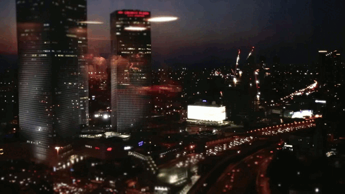

Abaixo temos o código do algoritmo _tiltshiftvideo.cpp_.
```c++
#include <iostream>
#include <string>

#include <opencv2/opencv.hpp>

using namespace cv;
using namespace std;

int main(int argvc, char** argv){
	const string source = argv[1];
	int cont = 0, taxa = 2;
	
	// Abertura do vídeo e obtenção de alguns dos seus parâmetros
	VideoCapture inputVideo(source);
	if (!inputVideo.isOpened()){
        	cout  << "O vídeo não pode ser aberto: " << source << endl;
        	return -1;
    	}
    	
    	Size S = Size((int) inputVideo.get(CAP_PROP_FRAME_WIDTH),    
                      (int) inputVideo.get(CAP_PROP_FRAME_HEIGHT));
        
     	// Criação do arquivo de vídeo para escrita
    	VideoWriter outputVideo;
    	outputVideo.open("saida.mkv", cv::VideoWriter::fourcc('D', 'I', 'V', '3'), inputVideo.get(CAP_PROP_FPS)/taxa, S, true);  //CV_FOURCC	   
	if (!outputVideo.isOpened()){
		cout  << "Não é possivel abrir o arquivo para escrita: " << source << endl;
		return -1;
	}
	
	// Parâmetros para efeito Tiltshift
	Mat mask(9,9,CV_32F), mask1;
	Mat image32f, imageFiltered, result;
	Mat image1, image2, res;

	double alfa;

	double altura = 0.6 * S.height; // A altura da região central será 60% da altura do vídeo 
	double centro = 0.5 * S.height; // A posição vertical do centro da região que entrará em foco estará bem no meio do vídeo
	double decaimento = 10; // O decaimento da região borrada será 10
	double l1 = centro - altura/2;
	double l2 = centro + altura/2;
	
	float media[] = {1,1,1,1,1,1,1,1,1,
 	 	         1,1,1,1,1,1,1,1,1,
 	 	         1,1,1,1,1,1,1,1,1,
 	 	         1,1,1,1,1,1,1,1,1,
 	 	         1,1,1,1,1,1,1,1,1,
 	 	         1,1,1,1,1,1,1,1,1,
 	 	         1,1,1,1,1,1,1,1,1,
 	 	         1,1,1,1,1,1,1,1,1,
		         1,1,1,1,1,1,1,1,1};
	
  	mask = Mat(9, 9, CV_32F, media); 
	scaleAdd(mask, 1/81.0, Mat::zeros(9,9,CV_32F), mask1);
        swap(mask, mask1);
		
	for(;;){
   	   	cont++;
   		
   		if(cont > 100){
   			
			inputVideo >> image1;              
			if (image1.empty()) break; // checa se o vídeo acabou
			
			image2 = image1.clone();
			image2.convertTo(image32f, CV_32F);
			
			// A imagem é borrada várias vezes para poder ser notado melhor o efeito de borramento
			for (int i = 0; i < 100; i++) 
				filter2D(image32f, imageFiltered, image32f.depth(), mask, Point(2,2), 0);
			
			// A variável 'result' guarda a imagem borrada
			imageFiltered.convertTo(result, CV_8U); 
			
			for(int i = 0; i < result.size().height; i++){
				alfa = 0.5 * (tanh((i - l1) / decaimento) - tanh((i - l2) / decaimento));
				addWeighted(image1.row(i), alfa, result.row(i), 1.0 - alfa, 0.0, image2.row(i));
			}
       		
       			outputVideo << image2;
       			cont = 0;
       	}
    }

	return 0;
}
```

**7. Utilizando o programa exemplos/dft.cpp como referência, implemente o filtro homomórfico para melhorar imagens com iluminação irregular. Crie uma cena mal iluminada e ajuste os parâmetros do filtro homomórfico para corrigir a iluminação da melhor forma possível. Assuma que a imagem fornecida é em tons de cinza.**

Nesta imagem, podemos ver claramente a comparação entre a imagem original (sem iluminação) e a imagem como o filtro homomórfico aplicado:
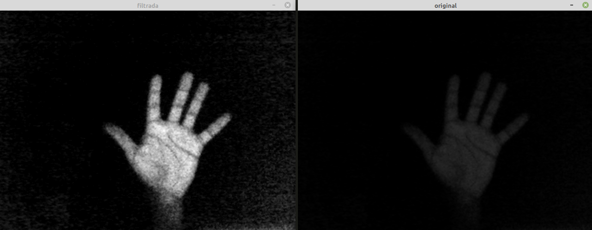

Abaixo temos o código do algoritmo _filtrohomomorfico.cpp_.
```c++
#include <iostream>
#include <opencv2/opencv.hpp>
#include <opencv2/imgproc/imgproc.hpp>


#define RADIUS 20

using namespace cv;
using namespace std;

// troca os quadrantes da imagem da DFT
void deslocaDFT(Mat& image ){
  Mat tmp, A, B, C, D;

  // se a imagem tiver tamanho impar, recorta a regiao para
  // evitar cópias de tamanho desigual
  image = image(Rect(0, 0, image.cols & -2, image.rows & -2));
  int cx = image.cols/2;
  int cy = image.rows/2;

  // reorganiza os quadrantes da transformada
  // A B   ->  D C
  // C D       B A
  A = image(Rect(0, 0, cx, cy));
  B = image(Rect(cx, 0, cx, cy));
  C = image(Rect(0, cy, cx, cy));
  D = image(Rect(cx, cy, cx, cy));

  // A <-> D
  A.copyTo(tmp);  D.copyTo(A);  tmp.copyTo(D);

  // C <-> B
  C.copyTo(tmp);  B.copyTo(C);  tmp.copyTo(B);
}

int main(int , char**){
  VideoCapture cap;
  Mat imaginaryInput, complexImage, multsp;
  Mat padded, filter, mag;
  Mat image, imagegray, tmp;
  Mat_<float> realInput, zeros;
  vector<Mat> planos;
  
  float Gh = 1.0, Gl = 1.0, d = 1.0, c = 1.0;
  double radius;

  // guarda tecla capturada
  char key;

  // valores ideais dos tamanhos da imagem
  // para calculo da DFT
  int dft_M, dft_N;

  // abre a câmera default
  cap.open(0);
  if(!cap.isOpened())
    return -1;

  // captura uma imagem para recuperar as
  // informacoes de gravação
  cap >> image;

  // identifica os tamanhos otimos para
  // calculo do FFT
  dft_M = getOptimalDFTSize(image.rows);
  dft_N = getOptimalDFTSize(image.cols);

  // realiza o padding da imagem
  copyMakeBorder(image, padded, 0,
                 dft_M - image.rows, 0,
                 dft_N - image.cols,
                 BORDER_CONSTANT, Scalar::all(0));

  // parte imaginaria da matriz complexa (preenchida com zeros)
  zeros = Mat_<float>::zeros(padded.size());

  // prepara a matriz complexa para ser preenchida
  complexImage = Mat(padded.size(), CV_32FC2, Scalar(0));

  // a função de transferência (filtro frequencial) deve ter o
  // mesmo tamanho e tipo da matriz complexa
  filter = complexImage.clone();

  // cria uma matriz temporária para criar as componentes real
  // e imaginaria do filtro ideal
  tmp = Mat(dft_M, dft_N, CV_32F);

  // prepara o filtro homomorfico
  for(int i=0; i<dft_M; i++)
  {
    for(int j=0; j<dft_N; j++)
    {
      radius = (double) (i - dft_M / 2) * (i - dft_M / 2) + (j - dft_N / 2) * (j - dft_N / 2);
      tmp.at<float> (i, j) = (Gh - Gl) * (1 - exp(-c * (radius / pow(d, 2)))) + Gl;
    }
  }

  // cria a matriz com as componentes do filtro e junta
  // ambas em uma matriz multicanal complexa
  Mat comps[]= {tmp, tmp};
  merge(comps, 2, filter);

  for(;;){
    cap >> image;
    cvtColor(image, imagegray, cv::COLOR_BGR2GRAY);//CV_BGR2GRAY
    imshow("original", imagegray);

    // realiza o padding da imagem
    copyMakeBorder(imagegray, padded, 0,
                   dft_M - image.rows, 0,
                   dft_N - image.cols,
                   BORDER_CONSTANT, Scalar::all(0));

    // limpa o array de matrizes que vao compor a
    // imagem complexa
    planos.clear();
    // cria a compoente real
    realInput = Mat_<float>(padded);
    // insere as duas componentes no array de matrizes
    planos.push_back(realInput);
    planos.push_back(zeros);

    // combina o array de matrizes em uma unica
    // componente complexa
    merge(planos, complexImage);

    // calcula o dft
    dft(complexImage, complexImage);

    // realiza a troca de quadrantes
    deslocaDFT(complexImage);

    // aplica o filtro frequencial
    mulSpectrums(complexImage,filter,complexImage,0);

    // limpa o array de planos
    planos.clear();

    // troca novamente os quadrantes
    deslocaDFT(complexImage);

    cout << "Gl = " << Gl << " Gh = " << Gh << " D0 = " << d << " c = " << c << endl;
    // calcula a DFT inversa
    idft(complexImage, complexImage);

    // limpa o array de planos
    planos.clear();

    // separa as partes real e imaginaria da
    // imagem filtrada
    split(complexImage, planos);

    // normaliza a parte real para exibicao
    normalize(planos[0], planos[0], 0, 1, cv::NORM_MINMAX);//CV_MINMAX
    imshow("filtrada", planos[0]);

    key = (char) waitKey(10);
    if( key == 27 ) break; // esc pressed!
    switch(key){
      // aumenta o componente de iluminância (Gl)
    case 'a':
      Gl = Gl + 1;
      break;
      // diminui o componente de iluminância (Gl)
    case 's':
      Gl = Gl - 1;
      break;
      // aumenta o componente de refletância (Gh)
    case 'd':
      Gh = Gh + 1;
      break;
      // diminui o componente de refletância (Gh)
    case 'f':
      Gh = Gh - 1;
      // aumenta o componente de frequencia de corte (d)
    case 'g':
      d = d + 1;
      break;
      // diminui o componente de frequencia de corte (d)
    case 'h':
      d = d - 1;
      break;
      // aumenta a constante (c)
    case 'j':
      c = c + 1;
      break;
      // diminui a constante (c)
    case 'k':
      c = c - 1;
      break;
    }
  }
  return 0;
}
```
O efeito é obtido avaliando e tratando os componentes básicos da geração de uma imagem, como iluminância e reflectância.

**8. Utilizando os programas exemplos/canny.cpp e exemplos/pontilhismo.cpp como referência, implemente um programa cannypoints.cpp. A idéia é usar as bordas produzidas pelo algoritmo de Canny para melhorar a qualidade da imagem pontilhista gerada. A forma como a informação de borda será usada é livre. Entretanto, são apresentadas algumas sugestões de técnicas que poderiam ser utilizadas:
        Desenhar pontos grandes na imagem pontilhista básica;
        Usar a posição dos pixels de borda encontrados pelo algoritmo de Canny para desenhar pontos nos respectivos locais na imagem gerada.
        Experimente ir aumentando os limiares do algoritmo de Canny e, para cada novo par de limiares, desenhar círculos cada vez menores nas posições encontradas.**
	
**Escolha uma imagem de seu gosto e aplique a técnica que você desenvolveu.**
**Descreva no seu relatório detalhes do procedimento usado para criar sua técnica pontilhista.**

Esta é a imagem normal, utilizada para fazer a compração:


Imagem com o algoritmo _canny.cpp_ aplicado:
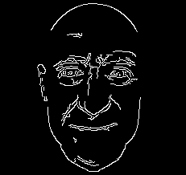

Imagem com o algoritmo _pontilhismo.cpp_ aplicado:
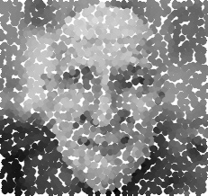

Imagem com o algoritmo _nova.cpp_, feito pela combinação de _canny_ e _pontilhismo_: 
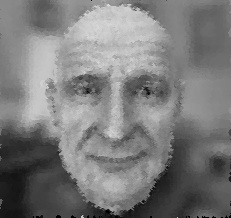

Abaixo temos o código do algoritmo _nova.cpp_.
```c++
#include <iostream>
#include <opencv2/opencv.hpp>
#include <fstream>
#include <iomanip>
#include <vector>
#include <algorithm>
#include <numeric>
#include <ctime>
#include <cstdlib>

using namespace std;
using namespace cv;

#define STEP 1
#define JITTER 3
#define RAIO 1

int top_slider = 10;
int top_slider_max = 200;

char TrackbarName[50];

Mat image, border, frame, points;

void on_trackbar_canny(int, void*){
  Canny(image, border, top_slider, 3*top_slider);
  // imshow("canny", border);
}

int main(int argc, char** argv){
  vector<int> yrange;
  vector<int> xrange;

  int width, height, gray;
  int x, y;
  
  image= imread(argv[1],IMREAD_GRAYSCALE);

  srand(time(0));
  
  if(!image.data){
  cout << "nao abriu" << argv[1] << endl;
    cout << argv[0] << " imagem.jpg";
    exit(0);
  }

  width=image.size().width;
  height=image.size().height;


  createTrackbar( TrackbarName, "canny",
                &top_slider,
                top_slider_max,
                on_trackbar_canny );

  on_trackbar_canny(top_slider, 0 );

  xrange.resize(height/STEP);
  yrange.resize(width/STEP);
  
  iota(xrange.begin(), xrange.end(), 0); 
  iota(yrange.begin(), yrange.end(), 0);

  for(uint i=0; i<xrange.size(); i++){
    xrange[i]= xrange[i]*STEP+STEP/2;
  }

  for(uint i=0; i<yrange.size(); i++){
    yrange[i]= yrange[i]*STEP+STEP/2;
  }

  points = Mat(height, width, CV_8U, Scalar(255));

  random_shuffle(xrange.begin(), xrange.end());
  
  for(auto i : xrange){
    for(auto j : yrange){
      x = i+rand()%(2*JITTER)-JITTER+1;
      y = j+rand()%(2*JITTER)-JITTER+1;
      gray = image.at<uchar>(x,y);
        circle(points,
             cv::Point(y,x),
              RAIO+2,
             CV_RGB(gray,gray,gray),
             -1,
             cv::LINE_AA);
      }
    }
    for(auto i : xrange){
      for(auto j : yrange){
        x = i+rand()%(2*JITTER)-JITTER+1;
        y = j+rand()%(2*JITTER)-JITTER+1;
        gray = image.at<uchar>(x,y);
        if(border.at<uchar>(x,y) == 255)
        {
          circle(points,
              cv::Point(y,x),
              RAIO,
              CV_RGB(gray,gray,gray),
              -1,
              cv::LINE_AA);
        }
      }
    }

  imwrite("pontos_nova.jpg", points);
  return 0;
}
```
**9. Utilizando o programa kmeans.cpp como exemplo prepare um programa exemplo onde a execução do código se dê usando o parâmetro nRodadas=1 e inciar os centros de forma aleatória usando o parâmetro KMEANS_RANDOM_CENTERS ao invés de KMEANS_PP_CENTERS. Realize 10 rodadas diferentes do algoritmo e compare as imagens produzidas. Explique porque elas podem diferir tanto.**
	
Esta é a imagem normal, utilizada para fazer a compração: 


Imagem de saída com o programa _kmeans.cpp_ executado:
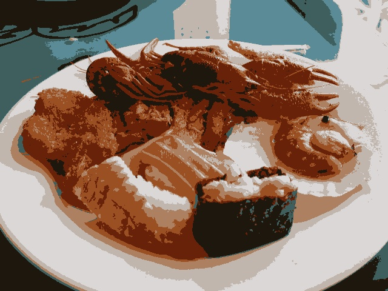

O algoritmo _kmeans_ aglorema as saídas, quando a gente vai rodando o código. O algoritmo pode diferir muito, porque em cada execução o programa pode considerar uma grande região para ser mapeada, ou não.

Abaixo temos o código do algoritmo _kmeans.cpp_.
```c++
#include <opencv2/opencv.hpp>
#include <cstdlib>

using namespace cv;

int main( int argc, char** argv ){
  int nClusters = 8;
  Mat rotulos;
  int nRodadas = 5;
  Mat centros;

  if(argc!=3){
  exit(0);
  }

  Mat img = imread( argv[1], IMREAD_COLOR);
  Mat samples(img.rows * img.cols, 3, CV_32F);

  for( int y = 0; y < img.rows; y++ ){
    for( int x = 0; x < img.cols; x++ ){
      for( int z = 0; z < 3; z++){
        samples.at<float>(y + x*img.rows, z) = img.at<Vec3b>(y,x)[z];
      }
    }
  }

  kmeans(samples,
     nClusters,
     rotulos,
     TermCriteria(TermCriteria::MAX_ITER|TermCriteria::EPS, 10000, 0.0001),//CV_TERMCRIT_ITER|CV_TERMCRIT_EPS
     nRodadas,
     KMEANS_PP_CENTERS,
     centros );


  Mat rotulada( img.size(), img.type() );
  for( int y = 0; y < img.rows; y++ ){
    for( int x = 0; x < img.cols; x++ ){
    int indice = rotulos.at<int>(y + x*img.rows,0);
    rotulada.at<Vec3b>(y,x)[0] = (uchar) centros.at<float>(indice, 0);
    rotulada.at<Vec3b>(y,x)[1] = (uchar) centros.at<float>(indice, 1);
    rotulada.at<Vec3b>(y,x)[2] = (uchar) centros.at<float>(indice, 2);
    }
  }
  imshow( "clustered image", rotulada );
  imwrite(argv[2], rotulada);
  waitKey( 0 );
}
```
